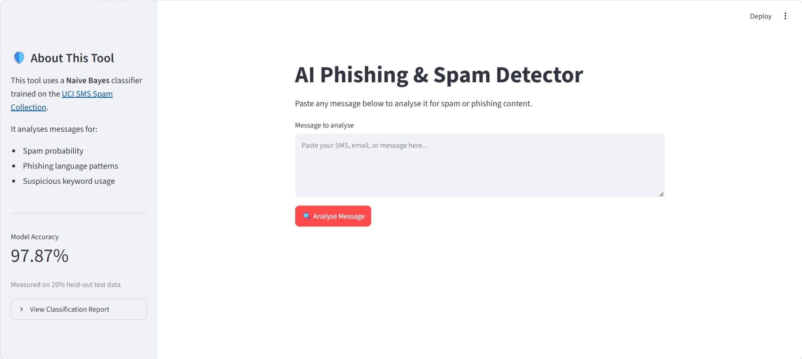
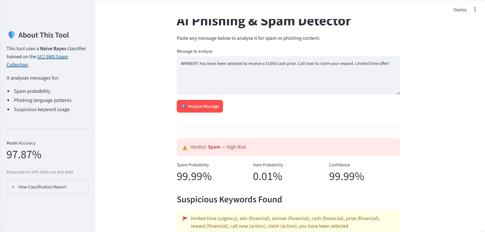
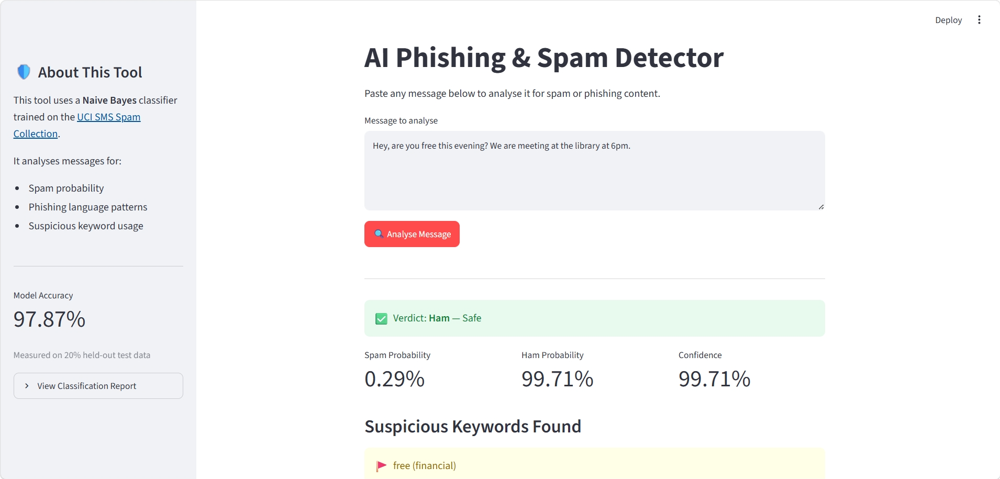

# 🛡️ AI Phishing & Spam Detection

A machine learning web application that detects spam and phishing messages 
using Natural Language Processing and a Naive Bayes classifier.

Built with Python, Scikit-learn, and Streamlit.

---

## 📸 Screenshots

### Home Page

### Spam Detected

### Safe Message

---

## ✨ Features

- ✅ Real-time spam and phishing detection
- ✅ Confidence score for every prediction
- ✅ Risk level indicator (High Risk / Medium Risk / Safe)
- ✅ Suspicious keyword detection and categorisation
- ✅ Model accuracy displayed in sidebar
- ✅ Full classification report available in sidebar
- ✅ Clean, organised codebase split across multiple files

---

## 🧠 How It Works
User Input (message)
│
▼
TF-IDF Vectorizer
(converts text to numbers)
│
▼
Naive Bayes Classifier
(trained on 5,500+ SMS messages)
│
▼
Prediction + Confidence Score + Risk Level

1. The message is converted into numerical features using **TF-IDF**
2. The **Naive Bayes classifier** predicts spam or ham
3. A **confidence score** shows how certain the model is
4. **Suspicious keywords** are scanned and categorised
5. A **risk level** is assigned based on confidence

---

## 🗂️ Project Structure
AI-Phishing-Spam-Detection/
│
├── app.py # Streamlit user interface
├── model.py # Machine learning pipeline
├── utils.py # Helper functions
├── requirements.txt # Python dependencies
├── sms.tsv # Training dataset
│
├── screenshots/
│ ├── home.png
│ ├── spam_result.png
│ └── safe_result.png

---

## 🛠️ Technologies Used

| Technology | Purpose |
|------------|---------|
| Python 3 | Core language |
| Streamlit | Web interface |
| Scikit-learn | Machine learning |
| Pandas | Data handling |
| TF-IDF Vectorizer | Text to numbers |
| Naive Bayes (MultinomialNB) | Classification |

---

## 📊 Model Performance

- **Algorithm:** Multinomial Naive Bayes
- **Dataset:** UCI SMS Spam Collection (5,500+ messages)
- **Accuracy:** ~97-98% on held-out test data
- **Train/Test Split:** 80% training, 20% testing
- **Features:** Top 5,000 TF-IDF weighted terms

---

## ⚙️ Installation & Usage

### 1. Clone the repository

git clone https://github.com/YOUR-USERNAME/AI-Phishing-Spam-Detection.git
cd AI-Phishing-Spam-Detection

2. Install dependencies
pip install -r requirements.txt

3. Run the app

streamlit run app.py
4. Open in browser

http://localhost:8501

🧪 Test Messages

Spam example:

WINNER!! You have been selected to receive a £1000 cash prize. 
Call now to claim your reward. Limited time offer!

Ham example:

Hey, are you free this evening? 
We are meeting at the library at 6pm.

🔮 Future Improvements

1. Add support for email header analysis
 2.Train on a larger and more diverse dataset
 3.Add URL scanning for phishing links
 4.Export prediction history as CSV
 5.Deploy to Streamlit Cloud for public access
 6.Add multilingual support

👤 Author
SKAND SHARMA
Cybersecurity Student

GitHub • https://github.com/Skand0007?tab=repositories

EMAIL: 0007SKAND@GMAIL.COM

